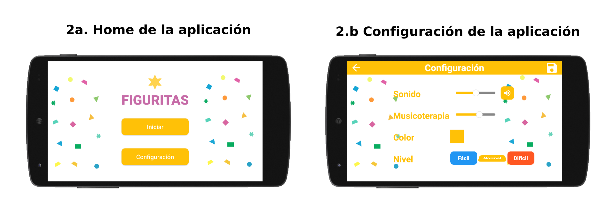
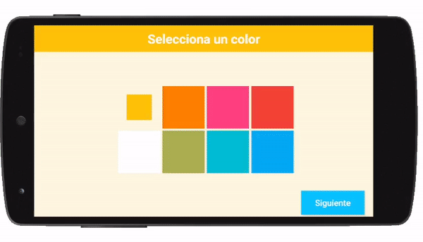
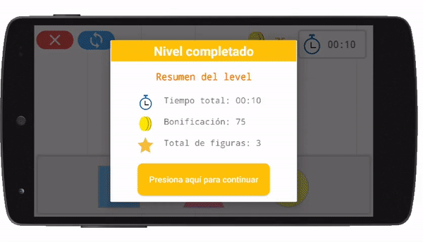
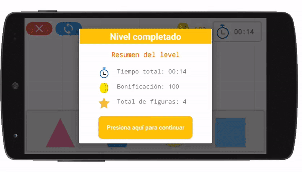

# Figuritas

“Figuritas” es un proyecto para la materia de Ingeniería de software. El objetivo es desarrollar un software completo desde el levantamiento de requerimientos hasta la implementación del mismo y validación de las pruebas en este.

El principal enfoque de este proyecto es el poder ayudar a niños con TEA (Trastorno del espectro autista) con una edad de aproximadamente 6 y 10 años con diferentes actividades que estimulen su aprendizaje. 

La dinámica de la aplicación es sencilla, básicamente consta de arrastrar las diferentes figuras a su slot correspondiente, a medida que se van completando las actividades el número de figuras disponibles en el tablero se van incrementando, de este modo aumentando ligeramente la dificultad. 

 

### Características del proyecto 

- Android 6.0 (API 23) versión mínima soportada
- Java 8 como lenguaje de programación
- SQLite para la persistencia de datos
- Room como ORM
- Navigation Component para la navegación entre fragmentos

 
 

## Pantallas de aplicación

> Inicio de sesión y registro de una nueva cuenta local (1.a), personalización inicial de la aplicación cuando se inicia por primera vez (1.b)

 

> Pantalla principal de la aplicación cuando se ha iniciado sesión (2.a), pantalla que muestra el apartado de configuración de la aplicación (2.b)

 
 

## Configuración inicial

Al momento de iniciar la aplicación por primera vez se mostrará un pequeño recorrido el cual permitirá realizar una ligera personalización de la aplicación, desde el tema de colores a utilizar en toda la aplicación, configuración del sonido hasta la dificultad de las actividades. Una vez completado el recorrido no volverá aparecer en inicios posteriores, para poder realizar cualquier configuración se tendrá que ir a la sección de configuración que aparece en la pantalla de “Home” de la aplicación.

> Personalización inicial cuando se inicia la aplicación por primera vez, permite seleccionar un tema de color para la aplicación, configurar el volumen y la dificultad 

 
 

## Demostración de la dinámica de aplicación 

En esta sección se muestra la dinámica de las actividades realizadas en la aplicación, básicamente es arrastrar las distintas figuras del tablero a su slot correspondiente en la parte inferior. A medida que se completa un nivel se avanza al siguiente con un número mayor de figuras que arrastrar, de esta manera aumentando ligeramente la dificultad de las actividades.

> Muestra de interacción con un nivel de la aplicación, en este se trabaja con 4 figuras simples.

> Muestra de interacción con el siguiente nivel de la aplicación, en este se trabaja ahora con 5 figuras simples, aumentando ligeramente la dificultad de este. 
